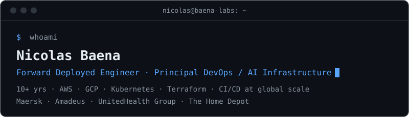
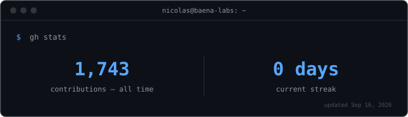

DevOps Manager with **10+ years** building and running cloud infrastructure for Fortune-500 companies. Currently leading DevOps for **UnitedHealth Group** at [Publicis Sapient](https://www.publicissapient.com/).

---

## Track record

- **[UnitedHealth Group](https://www.unitedhealthgroup.com/)** — the largest health insurer in the US · delivery continuity across **30K+ GitHub repos** · CI/CD turnaround cut from hours to **minutes** with auto-remediation tooling · **−60% ML spend** via a GCP LLM cost platform
- **[The Home Depot](https://www.homedepot.com/)** — the largest home-improvement retailer in the US · Terraform IaC + **Sentinel policy enforcement** for enterprise-wide compliant deployments
- **[Amadeus](https://amadeus.com/en)** — the software behind the world's airlines · app delivery time **−40%** · MTTR **−55%** · 24/7 SRE rotation on a global high-availability platform
- **[Maersk](https://www.maersk.com/)** — the world's largest shipping & logistics company · built a secure AWS/GCP cloud data platform with SRE-grade availability and latency
- **[Reckitt](https://www.reckitt.com/)** — global consumer-goods leader · AWS spend **−90%** ($100K → $5K) by eliminating 10+ years of unused infrastructure across 50+ accounts
- Also — **−70% production incidents** and **+85% deploy success** as advisor to the CEO at [Fundamentl](https://fundamentlpartners.com/) · web3 platform reliability for [Giveth](https://giveth.io/) / [General Magic](https://www.generalmagic.io/)

---

## Stack

**Cloud**
&nbsp;

**Containers & orchestration**
&nbsp;

**IaC & CI/CD**
&nbsp;

**Observability**
&nbsp;

**Languages**
&nbsp;

**AI tooling**
&nbsp;

---

## Activity

---

## Credentials

[DevOps — AWS + Kubernetes](https://rolazo.github.io/devops-ci-challenge/certification/) · [Google Cloud Architect & Data Engineering](https://www.udemy.com/certificate/UC-e094f88e-2e65-4ddc-a469-f93c00ba7de9/) · [Linux](https://www.udemy.com/certificate/UC-7XSN7RY8/)

---

## Connect

